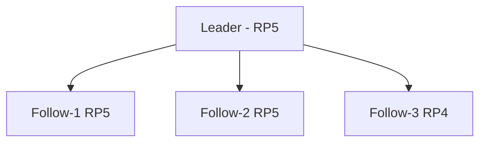

# My Homelab configuration

Currently consists of three Raspberry Pi 5's and one Raspberry Pi 4.



See [preparing nodes](./docs/preparing-nodes.md) for details on setting up individual Pi's.

## Initial setup

### 1. Install ArgoCD

```shell
kubectl create namespace argocd
kubectl apply -n argocd --server-side --force-conflicts -f https://raw.githubusercontent.com/argoproj/argo-cd/stable/manifests/install.yaml
```

Expose ArgoCD locally

```shell
kubectl port-forward svc/argocd-server -n argocd 8080:443
```

Retrieve the initial admin password

```shell
ARGOPASSWORD=$(kubectl -n argocd get secret argocd-initial-admin-secret -o=jsonpath={".data.password"} | base64 -d)
```

Login

```shell
argocd login localhost:8080 --insecure --password $ARGOPASSWORD --username admin
```

Update password

```shell
argocd account update-password --current-password $ARGOPASSWORD --new-password $NEWPASSWORD
```

Create cluster context

```shell
argocd cluster add k3s
```

Add this repo as an "app"

```shell
argocd app create apps --repo https://github.com/IrrelevantElephant/homelab.git --path apps --dest-server https://kubernetes.default.svc --dest-namespace default --revision v2
```

sync the app

```shell
argocd app sync apps
```

Modify argocd configmap to enable helm chart support in kustomize:

```
apiVersion: v1
kind: ConfigMap
metadata:
  name: argocd-cm
  namespace: argocd
data:
  kustomize.buildOptions: --enable-helm
```

## DNS with CloudFlare tunnels

Create the tunnel

```shell
cloudflared tunnel create argocd
```

Create a secret based on the file created by `cloudflared`
```shell
kubectl create secret generic argocd-tunnel-creds \
	--from-file=credentials.json=/home/harry/.cloudflared/$TUNNELID.json
```

```shell
cloudflared tunnel route dns argocd argocd.giulia-harry.dev
```

## Image pull secret

Create an image pull secret:

```shell
kubectl create secret generic regcred \
    --from-file=.dockerconfigjson=./.docker/config.json \
    --type=kubernetes.io/dockerconfigjson
```
